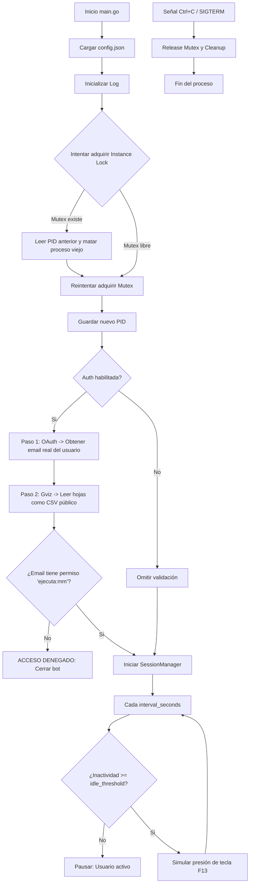

# 🛡️ KeepAlive Bot: Anti-Bloqueo de Sesión para Windows

Este proyecto es una herramienta de mantenimiento de sesión escrita en Go que previene el bloqueo automático de Windows. En lugar de mover el mouse, simula la presión de una **tecla fantasma (F13)**, la cual es completamente invisible para el usuario y las aplicaciones, pero suficiente para resetear el temporizador de inactividad del sistema.

Además, cuenta con un **sistema de control de acceso tipo "cortafuegos"** basado en Google Sheets, que verifica la identidad real del usuario (vía OAuth 2.0) y valida sus permisos leyendo la hoja como CSV público (vía Google Visualization API), garantizando que solo el personal autorizado pueda ejecutar el bot sin requerir configuraciones complejas de cuentas de servicio.

---

## 📋 Requisitos y Configuración Inicial

### 1. Instalar dependencias de Go
```bash
go mod init mouse-mov
go get golang.org/x/sys/windows
go get golang.org/x/oauth2
go get golang.org/x/oauth2/google
```

### 2. Instalación de wixl (para generar MSI en Linux)
```bash
# En Ubuntu/Debian/Lubuntu
sudo apt update
sudo apt install msitools wixl uuidgen
```

### 3. Configuración del Administrador (Google Cloud)
*Este paso solo lo realiza el administrador una sola vez.*

1. Crea un proyecto en [Google Cloud Console](https://console.cloud.google.com/).
2. Ve a **APIs y servicios** > **Pantalla de consentimiento de OAuth**. Configúrala como "Interna" (si usas Google Workspace) o "Externa" (para Gmail). Rellena el nombre de la app y el correo de soporte.
3. Ve a **APIs y servicios** > **Credenciales** > **Crear credenciales** > **ID de cliente de OAuth**.
   - Tipo de aplicación: **Aplicación de escritorio**.
   - Nombre: `bot-desktop-client`.
   - Haz clic en **Crear** y descarga el archivo JSON.
4. Abre tu hoja de cálculo de Google Sheets, haz clic en **Compartir** (esquina superior derecha) y en "Acceso general" selecciona: **"Cualquier persona con el enlace"** → **Lector**. *(Nota: La hoja solo debe contener correos, IDs de rol y nombres de permisos, sin datos sensibles).*
5. Abre el archivo JSON descargado, copia todo su contenido y pégalo reemplazando el string en la constante `OAuthCredentials` dentro del archivo `controller/credentials.go`.

### 4. Configuración del Bot (`config.json`)
Crea un archivo `config.json` en la raíz del proyecto. Gracias a los valores por defecto hardcodeados, este archivo puede ser mínimo:

```json
{
    "keep_alive": {
        "enabled": true,
        "interval_seconds": 60,
        "idle_threshold_seconds": 30
    },
    "log_path": "%TEMP%\\RuntimeBrokerLogs"
}
```
*(Opcional: Puedes agregar un bloque `"auth": { "spreadsheet_id": "TU_ID", "required_permission": "ejecuta:mm" }` si necesitas sobrescribir los valores por defecto del administrador).*

### 5. Ejecutar el Proyecto

```bash
# Desarrollo (con consola visible para ver el flujo de OAuth la primera vez)
go run main.go

# Producción (sin consola, camuflado)
GOOS=windows GOARCH=amd64 go build -ldflags="-H windowsgui" -o RuntimeBroker.exe main.go
```

---

## 🛠️ Procesos de Compilación

### Script de Build Automatizado
El proyecto incluye `build.sh`, que compila el ejecutable, gestiona la limpieza y genera el instalador MSI:

```bash
# Dar permisos de ejecución (primera vez)
chmod +x build.sh

# Compilar todo (EXE + MSI)
./build.sh

# Limpiar directorio de build
./build.sh clean
```

**El script genera en la carpeta `build/`:**
- `RuntimeBroker.exe` - Ejecutable portable camuflado.
- `RuntimeBroker.msi` - Instalador con acceso directo en el Menú Inicio.
- `runtime.wxs` - Archivo fuente de WiX (intermedio).

---

## 📂 Estructura del Proyecto

```text
.
├── config.json                 # Configuración del bot (opcional, usa defaults)
├── controller/                 # Lógica de negocio central
│   ├── Config.go               # Carga de configuración con fallback inteligente
│   ├── GoogleAuth.go           # 🔐 Flujo: OAuth (identidad) + Gviz CSV (permisos)
│   ├── InstanceLock.go         # 🔒 Mutex y gestión de PID para instancia única (Windows)
│   ├── Log.go                  # Sistema de logging thread-safe con limpieza automática (7 días)
│   ├── SessionManager.go       # 🔄 Gestor del ciclo de vida y temporizador del bot
│   ├── credentials.go          # 📄 Contenido de credentials.json embebido en el binario
│   ├── dlls_windows.go         # ⚙️ Centralización de llamadas a user32.dll y kernel32.dll
│   ├── keyboard_windows.go     # ⌨️ Simulación de tecla fantasma (F13) y detección de inactividad
│   ├── instance_other.go       # 🐧 Stub para Linux/macOS (instancia única)
│   └── keyboard_other.go       # 🐧 Stub para Linux/macOS (simulación de teclas)
├── main.go                     # Punto de entrada: orquesta inicialización, lock y shutdown
├── build.sh                    # Script de compilación y generación de MSI
├── README.md                   # Esta documentación
└── build/                      # Directorio de artefactos (autogenerado, ignorado en Git)
    ├── RuntimeBroker.exe       
    ├── RuntimeBroker.msi       
    └── runtime.wxs             
```

---

## 🔄 Diagrama de Flujo de Ejecución



---

## 🔒 Seguridad, Camuflaje y Robustez

1. **Nombre de Proceso:** El ejecutable se compila como `RuntimeBroker.exe`. En el Administrador de Tareas se camufla entre las múltiples instancias legítimas de este proceso de Windows.
2. **Tecla Fantasma (F13):** A diferencia de mover el mouse o presionar teclas numéricas, F13 es una tecla virtual que **no escribe caracteres, no activa LEDs y no interfiere** con aplicaciones activas.
3. **Autenticación Ultraligera:** 
   - **OAuth 2.0** garantiza que el correo del usuario es real y no fue falsificado en un archivo de texto.
   - **Google Visualization API (gviz)** permite leer la hoja de permisos como un CSV público, eliminando la necesidad de cuentas de servicio, librerías pesadas o compartir la hoja con robots externos.
4. **Instancia Única Garantizada:** Utiliza un `Named Mutex` global y un archivo PID. Si se intenta ejecutar el bot dos veces, la nueva instancia detectará la anterior, la terminará de forma controlada y tomará su lugar.
5. **Detección de Inactividad:** Usa `GetLastInputInfo` de Windows. Si el usuario está usando el teclado o el mouse, el bot **se pausa automáticamente** y espera, evitando interferencias.
6. **Credenciales Embebidas:** El archivo `credentials.json` se compila directamente dentro del binario (`credentials.go`), evitando archivos sueltos y facilitando la distribución segura.

### Verificación y Control (Windows)

**Verificar si está corriendo:**
```cmd
tasklist /FI "IMAGENAME eq RuntimeBroker.exe"
```

**Detener el proceso manualmente:**
```cmd
taskkill /F /IM RuntimeBroker.exe
```

---

## 📝 Sistema de Logs

El bot genera logs automáticamente. Si no tiene permisos en `%TEMP%`, usa la carpeta del ejecutable como fallback.

**Ruta por defecto:**
```text
C:\Users\TU_USUARIO\AppData\Local\Temp\logs\procesos\LogProcesos_2026-07-25.txt
C:\Users\TU_USUARIO\AppData\Local\Temp\logs\errores\LogErrores_2026-07-25.txt
```

**Ejemplo de log exitoso:**
```text
========================================================================================================================
| INICIO DE EJECUCIÓN - RuntimeBroker - 2026-07-25 12:56:27                                                           |
========================================================================================================================
| SUCCESS: 🔒 Instancia única adquirida (PID: 2040)                                                                   |
| Hora: 2026-07-25 12:56:27                                                                                            |
========================================================================================================================
| INFO: 🔐 Paso 1: Verificando identidad del usuario vía OAuth...                                                     |
| Hora: 2026-07-25 12:56:27                                                                                            |
========================================================================================================================
| SUCCESS: ✅ Identidad verificada: usuario@empresa.com                                                                 |
| Hora: 2026-07-25 12:56:27                                                                                            |
========================================================================================================================
| INFO: 🔍 Paso 2: Validando permisos en hoja (modo público)...                                                       |
| Hora: 2026-07-25 12:56:27                                                                                            |
========================================================================================================================
| SUCCESS: ✅ Usuario usuario@empresa.com validado correctamente con permiso 'ejecuta:mm'                             |
| Hora: 2026-07-25 12:56:27                                                                                            |
========================================================================================================================
| INFO: ⌨️  Keep-Alive iniciado. Intervalo: 60s, Umbral de inactividad: 30s                                           |
| Hora: 2026-07-25 12:56:27                                                                                            |
========================================================================================================================
```
*Nota: Los logs de más de 7 días se eliminan automáticamente al iniciar el bot.*

---

## 🚀 Instalación del MSI

El instalador `RuntimeBroker.msi` realiza las siguientes acciones en Windows:
1. **Instala en:** `C:\Program Files\RuntimeBroker\`
2. **Crea acceso directo:** Menú Inicio → "Runtime Broker"
3. **Registra en:** `HKCU\Software\Microsoft\RuntimeBroker`
4. **Fabricante:** Microsoft Corporation (para mayor camuflaje en la lista de programas)

**Para instalar:**
```cmd
msiexec /i RuntimeBroker.msi
```

**Para desinstalar:**
```cmd
msiexec /x RuntimeBroker.msi
```
*(O desde "Agregar o quitar programas" en Windows).*

---

## 🧪 Desarrollo y Testing

### Compilar para Linux (Testing de lógica)
```bash
go build -o keepalive-test main.go
./keepalive-test
```
*Es esperado ver mensajes indicando que la simulación de teclas y la instancia única no están soportadas en Linux, ya que el código usa los archivos `*_other.go`.*

### Ver archivos compilados por plataforma
```bash
# Para Windows (incluye lógica real)
GOOS=windows go list -f '{{.GoFiles}}' ./controller
# Salida: [Config.go GoogleAuth.go InstanceLock.go Log.go SessionManager.go credentials.go dlls_windows.go keyboard_windows.go]

# Para Linux (incluye solo stubs)
go list -f '{{.GoFiles}}' ./controller
# Salida: [Config.go GoogleAuth.go Log.go SessionManager.go credentials.go instance_other.go keyboard_other.go]
```

---

## 💡 Créditos y Referencias

- **API de Windows:** Uso de `golang.org/x/sys/windows` para llamadas nativas a `user32.dll` (`keybd_event`, `GetLastInputInfo`) y `kernel32.dll` (`CreateMutexW`, `GetTickCount`).
- **Google OAuth 2.0:** Uso de `golang.org/x/oauth2` para el flujo de autenticación de usuario.
- **Google Visualization API (gviz):** Lectura ultraligera de hojas de cálculo como CSV mediante `net/http` y `encoding/csv` estándar de Go.
- **Build Tags:** Implementación de compilación condicional con `//go:build windows` y `//go:build !windows` para mantener un código base multiplataforma limpio.
- **WiX Toolset:** Generación de MSI con `wixl` (implementación de WiX para Linux).
- **Principios de Diseño:** Single Responsibility, Thread-Safe Operations, Graceful Shutdown, Fail-Safe Fallbacks y Credenciales Embebidas.

---

## ⚠️ Disclaimer

Este proyecto está diseñado para uso personal, educativo y de administración de sistemas. El camuflaje como `RuntimeBroker.exe` es solo para evitar distracciones visuales en el Administrador de Tareas y mantener un perfil bajo. El bot:

- ✅ **NO** reemplaza ni interfiere con el `RuntimeBroker.exe` legítimo de Windows.
- ✅ **NO** tiene funcionalidades maliciosas, keyloggers ni de exfiltración de datos.
- ✅ **SOLO** simula la presión de la tecla virtual F13 cuando el sistema está inactivo.
- ✅ Se puede detener fácilmente con `taskkill` o reiniciando el equipo.

Úsalo responsablemente y respeta las políticas de seguridad de tu organización si se despliega en un entorno corporativo.