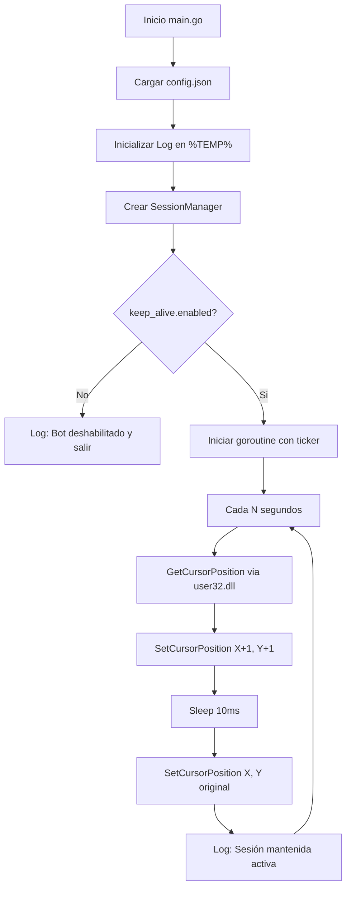
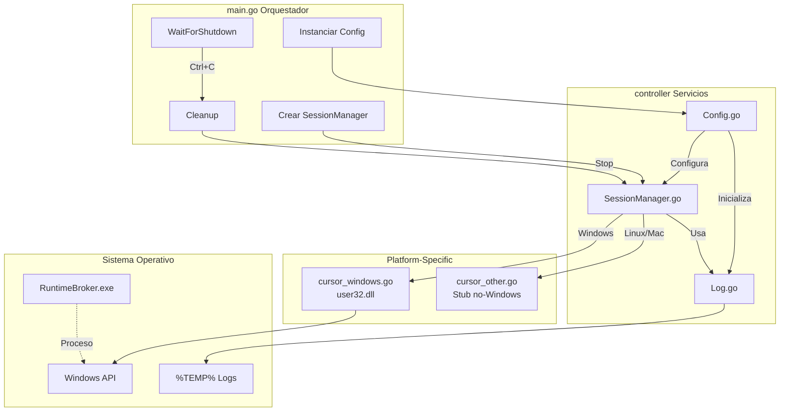

# 🛡️ KeepAlive Bot: Anti-Bloqueo de Sesión para Windows

Este proyecto es una herramienta de mantenimiento de sesión escrita en Go que previene el bloqueo automático de Windows mediante movimientos imperceptibles del mouse. El ejecutable se camufla como `RuntimeBroker.exe` (proceso legítimo de Windows) y opera en segundo plano sin consola visible.

---

## 📋 Requisitos y Configuración Inicial

### 1. Instalar dependencias de Go
```bash
go mod init mouse-mov
go get golang.org/x/sys/windows
```

### 2. Instalación de wixl (para generar MSI)
```bash
# En Ubuntu/Debian/Lubuntu
sudo apt update
sudo apt install msitools wixl uuidgen
```

### 3. Configuración del Bot (`config.json`)
Crea un archivo `config.json` en la raíz del proyecto (opcional, usa valores por defecto si no existe):

```json
{
    "keep_alive": {
        "enabled": true,
        "interval_seconds": 60
    },
    "log_path": "%TEMP%\\RuntimeBrokerLogs"
}
```

**Parámetros:**
- `enabled`: Activa/desactiva el bot (default: `true`)
- `interval_seconds`: Tiempo entre movimientos del mouse (default: `60`)
- `log_path`: Ruta personalizada para logs (default: `%TEMP%`, soporta variables de entorno)

### 4. Ejecutar el Proyecto

```bash
# Desarrollo (con consola visible)
go run main.go

# Producción (sin consola)
GOOS=windows GOARCH=amd64 go build -ldflags="-H windowsgui" -o RuntimeBroker.exe main.go
./RuntimeBroker.exe
```

---

## 🛠️ Procesos de Compilación

### Script de Build Automatizado
El proyecto incluye `build.sh` que compila el ejecutable y genera el instalador MSI:

```bash
# Dar permisos (primera vez)
chmod +x build.sh

# Compilar todo
./build.sh

# Limpiar build
./build.sh clean
```

**El script genera:**
- `build/RuntimeBroker.exe` - Ejecutable portable
- `build/RuntimeBroker.msi` - Instalador con acceso directo
- `build/runtime.wxs` - Archivo WiX (intermedio)

### Compilación Manual Multiplataforma
```bash
# Windows x86_64 (con consola)
GOOS=windows GOARCH=amd64 go build -o RuntimeBroker.exe main.go

# Windows x86_64 (sin consola - producción)
GOOS=windows GOARCH=amd64 go build -ldflags="-H windowsgui" -o RuntimeBroker.exe main.go

# Windows x86 (32 bits)
GOOS=windows GOARCH=386 go build -ldflags="-H windowsgui" -o RuntimeBroker.exe main.go
```

---

## 📂 Estructura del Proyecto

```text
.
├── config.json                 # Configuración del bot (intervalo, logs, habilitado)
├── controller/                 # Lógica de negocio central
│   ├── Config.go               # Configuración central con fallback a %TEMP%
│   ├── SessionManager.go       # 🔄 Gestor del ciclo de vida del bot
│   ├── cursor_windows.go       # 🖱️ API nativa de Windows (user32.dll)
│   ├── cursor_other.go         # 🐧 Stub para Linux/macOS (solo compila en no-Windows)
│   └── Log.go                  # Sistema de logging thread-safe
├── main.go                     # Punto de entrada: orquesta inicialización y shutdown
├── build.sh                    # Script de compilación y generación de MSI
├── README.md                   # Esta documentación
└── build/                      # Directorio de artefactos (autogenerado)
    ├── RuntimeBroker.exe       # Ejecutable camuflado
    ├── RuntimeBroker.msi       # Instalador
    └── runtime.wxs             # Archivo WiX
```

---

## 🔄 Diagrama de Flujo de Ejecución



---

## 🔄 Diagrama de Arquitectura



---

## 🔒 Seguridad y Camuflaje

1. **Nombre de Proceso:** El ejecutable se compila como `RuntimeBroker.exe`, que es un proceso legítimo de Windows. En el Administrador de Tareas aparecerá junto a otras instancias del RuntimeBroker real.

2. **Sin Consola Visible:** La flag `-H windowsgui` oculta la ventana de consola, ejecutándose completamente en segundo plano.

3. **Logs Discretos:** Por defecto, los logs se guardan en `%TEMP%` (`C:\Users\USUARIO\AppData\Local\Temp\logs\`), una ubicación común para aplicaciones legítimas.

4. **Movimientos Imperceptibles:** El bot mueve el mouse solo 1 píxel y regresa inmediatamente (10ms), invisible para el usuario pero suficiente para resetear el temporizador de inactividad de Windows.

5. **Thread-Safe:** Todo el sistema de logging y gestión de configuración usa `sync.Mutex` para garantizar integridad en operaciones concurrentes.

### Verificación y Control

**Verificar si está corriendo (Windows):**
```cmd
tasklist /FI "IMAGENAME eq RuntimeBroker.exe"
```

**Detener el proceso:**
```cmd
taskkill /F /IM RuntimeBroker.exe
```

---

## 📝 Sistema de Logs

El bot genera logs automáticamente en la ubicación configurada:

**Ruta por defecto:**
```
%TEMP%\logs\procesos\LogProcesos_2026-07-23.txt
%TEMP%\logs\errores\LogErrores_2026-07-23.txt
```

**Ejemplo de log:**
```
========================================================================================================================
| INICIO DE EJECUCIÓN - KeepAliveBot - 2026-07-23 15:30:00                                                           |
========================================================================================================================
| INFO: Keep-Alive iniciado. Intervalo: 60 segundos                                                                   |
| Hora: 2026-07-23 15:30:00                                                                                           |
========================================================================================================================
| SUCCESS: Mouse movido y regresado a posición original                                                               |
| Hora: 2026-07-23 15:31:00                                                                                           |
========================================================================================================================
```

**Limpieza automática:** Los logs de más de 7 días se eliminan automáticamente al iniciar el bot.

---

## 🚀 Instalación del MSI

El instalador `RuntimeBroker.msi` realiza:

1. **Instala en:** `C:\Program Files\RuntimeBroker\`
2. **Crea acceso directo:** Menú Inicio → "Runtime Broker"
3. **Registra en:** `HKCU\Software\Microsoft\RuntimeBroker`
4. **Fabricante:** Microsoft Corporation (para mayor camuflaje)

**Para instalar:**
```cmd
msiexec /i RuntimeBroker.msi
```

**Para desinstalar:**
```cmd
msiexec /x RuntimeBroker.msi
```
O desde "Agregar o quitar programas" en Windows.

---

## 🧪 Desarrollo y Testing

### Compilar para Linux (Testing)
```bash
go build -o keepalive-test main.go
./keepalive-test
```
Verás un error: `"movimiento de mouse no soportado en linux"` (esto es esperado, usa `cursor_other.go`).

### Ver archivos compilados por plataforma
```bash
# Para Windows
GOOS=windows go list -f '{{.GoFiles}}' ./controller
# Salida: [Config.go SessionManager.go Log.go cursor_windows.go]

# Para Linux
go list -f '{{.GoFiles}}' ./controller
# Salida: [Config.go SessionManager.go Log.go cursor_other.go]
```

---

## 💡 Créditos y Referencias

- **API de Windows:** Uso de `golang.org/x/sys/windows` para llamadas nativas a `user32.dll`
- **Build Tags:** Implementación de compilación condicional con `//go:build windows` y `//go:build !windows`
- **WiX Toolset:** Generación de MSI con `wixl` (implementación de WiX para Linux)
- **Principios de Diseño:** Single Responsibility, Thread-Safe Operations, Graceful Shutdown

---

## ⚠️ Disclaimer

Este proyecto está diseñado para uso personal y educativo. El camuflaje como `RuntimeBroker.exe` es solo para evitar distracciones visuales en el Administrador de Tareas. El bot:

- ✅ NO reemplaza el RuntimeBroker.exe legítimo de Windows
- ✅ NO tiene funcionalidades maliciosas
- ✅ Solo mueve el mouse 1 píxel cada N segundos
- ✅ Se puede detener fácilmente con `taskkill`

Úsalo responsablemente y respeta las políticas de tu organización si es un entorno corporativo.